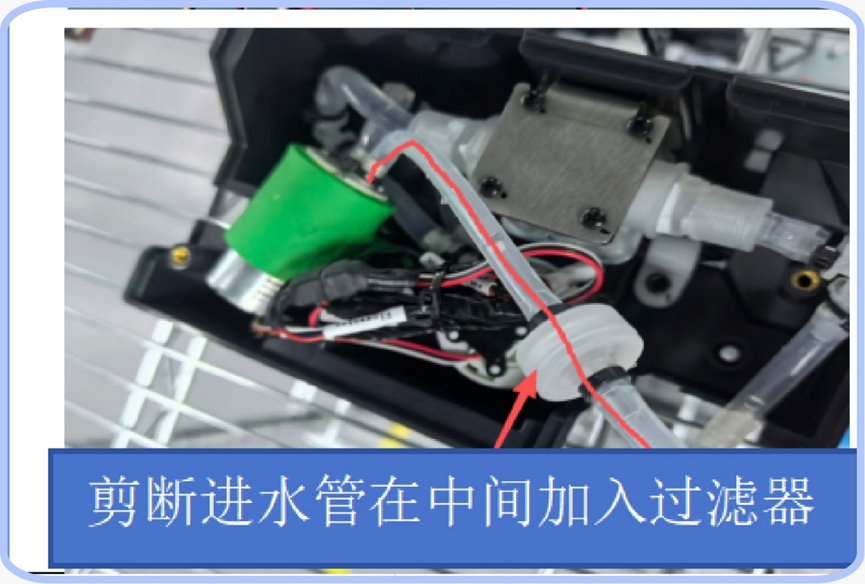

<h1>Problemas e Soluções</h1>

Este documento tem como objetivo auxiliar na identificação e resolução de falhas nos robôs, garantindo uma operação segura e eficiente.

**Para evitar falhas:**

- Garanta que o ambiente esteja conforme a instalação original

- Não mova o carregador de base de posição

- Limpe os sensores com regularidade

**Sumário**

[TOC]

# Linha DinerBot (T8, T9, T10, T11)

## Falhas de carregamento

**1. Carregamento lento utilizando carregador manual (T11)**

**Identificação:**  
Verificar se o modelo do carregador utilizado é de 6A.

**Possível causa:**  
Carregador antigo com amperagem baixa, não eficiente para o carregamento do robô.

**Resolução:**  
Substituir o carregador manual antigo por um de 6A.
---
**2.  O robô sai sozinho da base de carregamento sem motivo aparente (T10)**

**Identificação:** robô consegue começar a carregar com sucesso e luz do carregador fica verde, porém inesperadamente sai sozinho do carregador

**Possível causa: ?**

**Resolução:**

Verifique se o horário na qual acontece a saída do carregador está dentro do intervalo configurado de carregamento automático.

Se não estiver, avalie se está próximo ao horário de entrada ou saída do robô do expediente.

Se estiver,

**?**

## Falhas de navegação

**1. O robô derrama bebidas durante o transporte entre os pontos de origem e destino (T8)**

**Possível causa:** excesso de sujeira nas rodas; roda motorizada apresentando mal funcionamento

**Resolução:**

Para cada tópico, teste se o problema foi resolvido. Caso não tenha, siga para o tópico seguinte.

- Verifique com a equipe se estão utilizando o modo "Smooth Start" em vez de "Normal Start" para transporte de líquidos

- Verifique se a velocidade do "Smooth Start" está corretamente configurada (35 cm/s)

- Realize uma limpeza completa das rodas, removendo sujeira para melhorar a movimentação

- Substitua a roda com motor ("Hub Motor") direita por uma nova e teste. Se o problema persistir, substitua a outra.

## Falhas de inicialização

**1. \"Sensor fault - encoder has no data (115601)\" (T11)**

**Identificação:**

O robô não consegue inicializar e apresenta a mensagem:  
\"Sensor fault - encoder has no data (115601)\"

Nível da bateria sempre mostra 0%

Apesar do ROS ter iniado normalmente e o app de mapeamento pode ser acessado sem problemas, as informações do lidar e da stereovision não aparecem e o chassis version number não é revelado

**Possível causa:**

**Resolução:**

Troca da chassis control board por uma nova.

---
**2.  Falha em iniciar app de mapeamento ("Software cannot start") / Falha no app principal (T10)**

**Identificação:**  
O robô não conseguiu iniciar o mapeamento e apresentou a mensagem "Software cannot start"

**Possível causa:**

**Resolução:**

Para cada tópico, teste se o problema foi resolvido. Caso não tenha, siga para o tópico seguinte.

- Reinicie o robô

- Limpe o cache e dados do aplicativo Dinerbot e Robot Insallation Assistant

- Reinstale os aplicativos Dinerbot e Robot Installation Assistant e certifique-se que a versão utilizada é a mais recente

- Nas configurações do Android, procure pela opção de ativar/desativar o hotspot pessoal do robô. Conecte um computador a ele e tente mandar "ping 192.168.64.20" no prompt de comando. Caso não tenha resposta, troque a IPC do robô.

** 3. Robô inicia com interface de outro modelo**

**Identificação:**

Interface principal mostra foto de um modelo diferente do que deveria ser.

Funionalidades básicas podem não funcionar (Exemplos: tela do T10 não liga, detecção de bandeja não funciona)

**Possível causa:**
Arquivo product.properties vazio

**Resolução:**

---

## Falhas de hardware

**1. Tela touch da interface de operação não funciona**

**Possível causa:** Fio solto ou falha na tela

**Resolução:** 
Abra a parte do robô que contém a tela e certifique-se de que os cabos estão bem presos. Caso estejam, troque a tela defeituosa por uma nova.

---

**2. Botão de emergência ficou solto e ao tentar destravar o robô, os fios torceram internamente e se romperam**

**Possível causa:** Fio solto, uso inadequado/agressivo do botão

**Resolução:** troque o botão e fios de emergência defeituosos por um novo

## Outros

**1. Sensores das bandejas invertidos (T8/T11)**

**Identificação:**  
O pedido está configurado para a bandeja 1, porém o robô toma decisões com base nos itens da bandeja 2, e vice-versa.

O robô não aguarda o cliente retirar o pedido e sai imediatamente ao chegar no destino.

**Procedimento de validação:**

1.  Coloque um item na bandeja 1 e outro na bandeja 2

2.  Envie o robô para realizar a entrega do pedido da bandeja 1

3.  Ao chegar, aguarde alguns segundos e retire o objeto da bandeja 2

4.  Se o robô sair, realize uma segunda validação:

5.  Coloque novamente um item em cada bandeja, mas envie o robô para a bandeja 2

6.  Ao chegar, aguarde alguns segundos e retire o objeto da bandeja 1

7.  Se o robô sair, os sensores estão de fato invertidos

**Possível causa:**  
Ao ligar o robô, a atribuição das portas das câmeras ocorre com base na ordem de energização. Isso pode causar inversão na identificação caso não sejam inicializadas corretamente.

**Resolução:**  
Temporariamente, desligar o robô, aguardar pelo menos 1 minuto e ligá-lo novamente.

Caso o problema persista e gere impacto ao cliente, recomenda-se:

- Desabilitar a detecção automática

- Configurar um tempo fixo de entrega

Dessa forma, o robô permanecerá parado no destino pelo tempo definido, sem utilizar a detecção automática.

---

**2.  Robô não executa corretamente a dança automática de aniversário (T8)**

**Identificação:**

Ao utilizar a opção de "Parabéns personalizado", depois que se preenche as informações e seleciona um ponto para que o robô celebre, este não toca música no caminho e/ou quando chega no destino.

**Possível causa:**

Configuração do idioma utilizado interfere/danifica de alguma forma na fala da mensagem personalizada estabelecida no "parabéns personalizado".

Dança automática desabilitada

**Resolução:**

Para cada tópico, teste se o problema foi resolvido. Caso não tenha, siga para o tópico seguinte.

- Verifique se, quando as informações do parabéns estão sendo configuradas, a opção "Dança automática" localizada no fim da página está habilitada.

- Verifique na sessão "Aniversário" localizada nas configurações se a opção de "comece a dançar quando a música começar a cantar" está habilitada.

- Verifique se o som da música está razoavelmente alto na aba "Aniversário" dentro das configurações de som

- Troque o idioma para inglês, caso não esteja

- Reinicie o robô

# Linha CleanBot (C30, C40)

## Falhas de navegação

**1. O robô liga, mas não se move (C30)**

**Identificação:**

**Possível causa:**

Roda motorizada defeituosa.

**Resolução:**

Substituir roda motorizada defeituosas por nova.

## Falhas de inicialização

**1.  Falha em iniciar app de mapeamento ("Software cannot start") / Falha no app principal (C40)**

**Identificação:** O aplicativo do robô (CleanBot) não inicia (mensagem ininterrupta de "Startup in progress" na tela) e Robot Installation Assistant não abre e apresenta mensagem "Software cannot start"

**Possível causa:**

**Resolução:**

Para cada tópico, teste se o problema foi resolvido. Caso não tenha, siga para o tópico seguinte.

- Reinicie o robô

- Limpe o cache e dados do aplicativo Dinerbot e Robot Installation Assistant

- Reinstale os aplicativos Dinerbot e Robot Installation Assistant e certifique-se que a versão utilizada é a mais recente

- Nas configurações do Android, procure pela opção de ativar/desativar o hotspot pessoal do robô. Conecte um computador a ele e tente mandar "ping 192.168.64.20" no prompt de comando. Caso não tenha resposta, troque a IPC do robô.

---
**2.  Mensagem de erro "No Charging Pile found"**

**Identificação:**

Robô não consegue ir carregar sozinho quando clica em "Recharge";

Robô não consegue realizar limpeza imediata pois apresenta erro "No return points for this floor" quando configura o ponto de retorno da tarefa

OBS: para robô em questão, as vassouras dianteiras e o aspirador de trás não desciam à nível de solo.

**Possível causa: ?**

**Resolução:**

## Falhas de hardware

**1. Vazamento de água pelos orifícios de drenagem, mesmo com o robô parado**

**Possível causa:** Falta de Válvula Solenoide e filtro istalado.

**Resolução:**

1.  Drene a água do tanque retirando a peça verde na parte inferior traseira do robô

2.  Deite-o de modo em que possa acessar a parte de baixo

3.  Remova a tampa de água fixa por 2 parafusos M4

4.  Instale um filtro de água no canal mostrado na figura. Cortando o cano, adicione o filtro e isole novamente.

5.  Troque a válvula solenoide por uma nova

6.  Feche a tampa protetora

# Modelo S100

## Falhas de navegação/inicialização

**1. Robô não reconhece carregadores (manual ou base), indica 0% de bateria e não se move no mapa, mesmo sendo deslocado fisicamente (S100)**

**Identificação:**

Luzes da base desligadas mesmo com robô ligado

Ao clicar em qualquer um dos botões de emergência, o aviso de botão pressionado não aparece na tela

É possível movimentar o robô mesmo sem pressionar o botão de emergência

**Possível causa:** Chassis control board defeituosa

**Resolução:** Trocar Chassis control board defeituosa por uma nova

# Geral

## Falhas de carregamento

**1. Charging pile parou de funcionar**

**Identificação:**

A luz azul não muda para verde quando o robô encosta no carregador

A luz permanece verde mesmo após o robô sair do carregador

Nenhuma luz acende na parte superior do carregador

**Possível causa:** por que o carregado de base para de funcionar?

**Resolução:**  
Substituir o carregador com falha por um funcional.
---
**2. Carregador manual parou de funcionar**

**Identificação:**  
Luz indicativa na parte superior do carregador não acende.

**Possível causa:**

**Resolução:**  
Substituir o carregador manual antigo por um novo **ou** concertar o velho em um especialista elétrico **ou** configurar robô para utilizar carregador de base.

## Falhas de localização

**Identificação:**  
Robô invadindo áreas restritas ou se perdendo no ambiente;

Robô posicionando-se de forma incorreta em relação aos pontos criados no mapa.

**Possível causa:**  
Perda de calibração dos sensores.

**Resolução:**

1.  Verifique se o carregador de base está dentro da demarcação estabelecida na instalação

2.  Encoste o robô no carregador

3.  Verifique se a luz ficou verde

4.  Interrompa o carregamento

5.  Teste enviar o robô para alguns pontos e certifique-se de que o posicionamento está correto

## Falhas de mapeamento

**Mapa fica destorcido a medida que é expandido**

**Identificação:**

Corredores se fundindo/não paralelos entre si

**Possível causa:** Espaço extenso, com poucos pontos estáticos para referência 

**Resolução:** 

Considerações iniciais:

Antes de iniciar, distribua no espaço a ser mapeado objetos que podem ser reconhecidos pelo robô, como por exemplo caixas.

Não mapeie todo o espaço de uma vez. Divida-o em áreas e repita o processo abaixo para cada uma delas.

Uma localização bem sucedida e um mapa coerente com o espaço é percebido quando a leitura do LiDAR indicado no mapa é compátivel com o que está marcado em preto.

Procedimento:

1. Abra a ferramenta de mapeamento;

2. Encoste o robô no carregador;

3. Verifique se sua posição no mapa equivale a sua posição real;

4. Ande com o robô até um ponto que seja fácil de reconhecer tanto no mapa, quando no espaço fisico;

5. Clique longamente no botão "Complete" e selecione "close look point";

6. Comece a andar com o robô, sempre atento às leituras do LiDAR (pontos vermelhos no mapa). Essa leitura deve ser compativel aos pontos/linhas pretas registradas no mapa;

7. Caso haja distorção, pare de caminhar e movimente o robô lentamente no local onde houve a falha. Os objetos postos antes de iniciar o mapa podem ajudar a restaurar a localização;

8. Com a localização restaurada, siga escaneando o local, até finalizar a área;

9. Leve o robô até o ponto determinado no passo 5 e clique longamentente no botão "Complete", selecionando "finish close look point" quando aparecer

10. Complete o Scan e analise o resultado

## Outros

**1. Robô não liga / Robô desligou repentinamente e não liga novamente**

**Identificação:**  
Robô com tela preta, incapaz de ligar mesmo após deixá-lo carregando por tempo suficiente.

**Observação para T10:**  
Certifique-se de que os botões de energia localizados na base do robô e atrás da tela (lado esquerdo) foram pressionados. Caso já tenham sido, seguir os passos abaixo.

**Possível causa:**  
Bateria ou UI Board defeituosa

**Resolução:**

1.  Abra a parte do robô que contém a bateria:

2.  Meça com um multímetro a voltagem (PREENCHER COMO FAZER ISSO)

3.  Se permanecer em 0 V, substitua a bateria e teste. Se não tiver funcionado ou o multímetro indicar voltagem normal, siga os próximos passos:

4.  Substitua a UI Board (localizada atrás da tela touch, na cabeça do robô)
